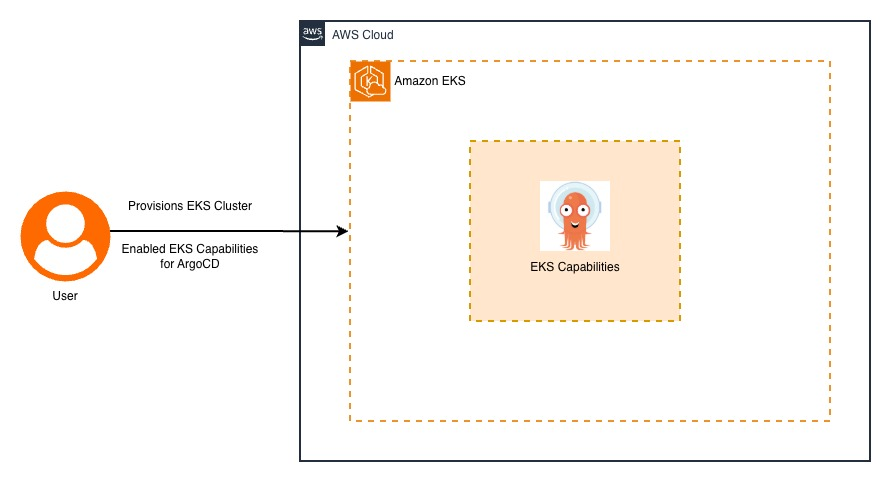

# k8s-eks-argocd-capabilities

A demonstration project showcasing GitOps capabilities using ArgoCD with Amazon EKS (Elastic Kubernetes Service). This project implements continuous deployment workflows for Kubernetes applications using ArgoCD's automated synchronization features.

## Architecture Overview



```
┌──────────────────────────────────────────────────────────────────────────────┐
│                                 GitOps Workflow                              │
└──────────────────────────────────────────────────────────────────────────────┘

┌──────────────────┐    ┌──────────────────┐    ┌──────────────────────────────────┐
│   Developer      │    │   Git Repository │    │         ArgoCD Server            │
│                  │    │                  │    │                                  │
│  1. Code Changes │───▶│  2. Push to      │───▶│  3. Detects Changes              │
│     & Commit     │    │     GitHub       │    │     & Syncs Applications         │
└──────────────────┘    └──────────────────┘    └──────────────────────────────────┘
                                                                    │
                                                                    ▼
┌──────────────────────────────────────────────────────────────────────────────┐
│                            Amazon EKS Cluster                                │
│  ┌─────────────────┐                           ┌─────────────────┐           │
│  │   Namespace:    │                           │   Namespace:    │           │
│  │   sample-app    │                           │  sample-app-v2  │           │
│  │                 │                           │                 │           │
│  │  ┌─────────────┐│                           │ ┌─────────────┐ │           │
│  │  │ nodejs-app  ││                           │ │nodejs-app-v2│ │           │
│  │  │ Deployment  ││                           │ │ Deployment  │ │           │
│  │  │ (2 replicas)││                           │ │ (2 replicas)│ │           │
│  │  └─────────────┘│                           │ └─────────────┘ │           │
│  │  ┌─────────────┐│                           │ ┌─────────────┐ │           │
│  │  │   Service   ││                           │ │   Service   │ │           │
│  │  │ ClusterIP   ││                           │ │ ClusterIP   │ │           │
│  │  └─────────────┘│                           │ └─────────────┘ │           │
│  └─────────────────┘                           └─────────────────┘           │
└──────────────────────────────────────────────────────────────────────────────┘
```

## Project Structure

```
k8s-eks-argocd-capabilities/
├── app-v1/                     # Version 1 application manifests
│   ├── deployment.yaml         # Kubernetes deployment and service
│   └── nodejs-app.yaml         # ArgoCD application definition
├── app-v2/                     # Version 2 application manifests
│   ├── deployment.yaml         # Kubernetes deployment and service
│   └── nodejs-app.yaml         # ArgoCD application definition
├── argo-secret.yaml            # EKS cluster connection secret
├── argocd.jpg                  # Architecture diagram
└── README.md                   # Project documentation
```

## Components

### ArgoCD Applications
- **nodejs-app**: Deploys to `sample-app` namespace
- **nodejs-app-v2**: Deploys to `sample-app-v2` namespace

### Kubernetes Resources
- **Deployments**: nginx-based applications with 2 replicas each
- **Services**: ClusterIP services for internal communication
- **Namespaces**: Automatically created via ArgoCD sync options

### GitOps Features
- **Automated Sync**: Applications automatically sync with Git repository changes
- **Self-Healing**: ArgoCD automatically corrects configuration drift
- **Pruning**: Removes resources not defined in Git
- **Server-Side Apply**: Uses Kubernetes server-side apply for better conflict resolution

## Key Configuration

### Sync Policy
```yaml
syncPolicy:
  automated:
    prune: true
    selfHeal: true
  syncOptions:
    - CreateNamespace=true
    - ServerSideApply=true
```

### Target Cluster
- **Cluster**: `prod-cluster-local`
- **EKS ARN**: `arn:aws:eks:us-west-1:501294308535:cluster/prod-eks`
- **Region**: us-west-1

## Getting Started

1. **Prerequisites**
   - Amazon EKS cluster running
   - ArgoCD installed on the cluster
   - kubectl configured for cluster access

2. **Deploy ArgoCD Applications**
   ```bash
   kubectl apply -f argo-secret.yaml
   kubectl apply -f app-v1/nodejs-app.yaml
   kubectl apply -f app-v2/nodejs-app.yaml
   ```

3. **Verify Deployments**
   ```bash
   kubectl get applications -n argocd
   kubectl get pods -n sample-app
   kubectl get pods -n sample-app-v2
   ```

## GitOps Workflow

1. **Code Changes**: Developers modify application manifests
2. **Git Push**: Changes are pushed to the GitHub repository
3. **ArgoCD Detection**: ArgoCD detects changes via polling
4. **Automatic Sync**: Applications are automatically synchronized
5. **Deployment**: New configurations are applied to the EKS cluster

## Benefits

- **Declarative**: Infrastructure and applications defined as code
- **Automated**: Continuous deployment without manual intervention
- **Auditable**: Complete change history in Git
- **Rollback**: Easy rollback using Git history
- **Multi-Environment**: Support for multiple application versions
